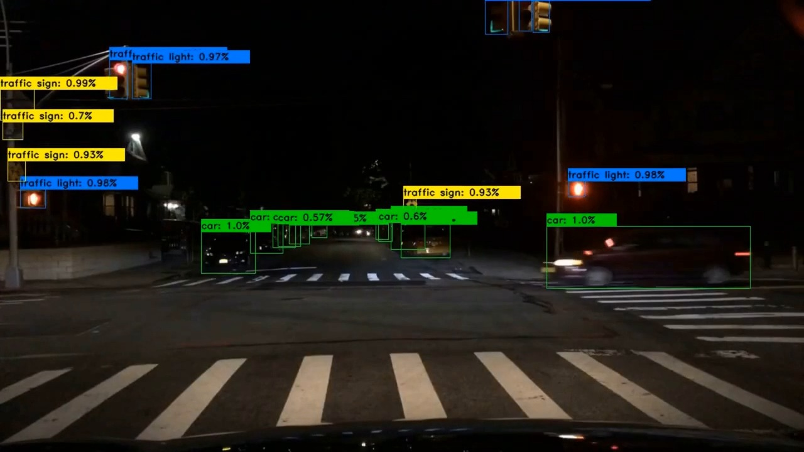

# Faster R-CNN via PyTorch and OpenCV

This project showcases a passion project towards the implementation of the novel Faster Regional Convolutional Neural Network (Faster R-CNN) deep learning model. For the implementation of this projet, I utilized PyTorch with an additional expansion for real time usage via OpenCV! This model was trained on an estimated of 100k images from Microsoft's COCO dataset, achieving a final accuracy of 65%.

**Model Results visualized**

Following displays a display image of real time object detection and classification for traffic on the road, generated via an OpenCV pipeline:

The full video is available as the demo.mp4 video! (Unfortunately, GitHub does not allow embedding videos!)
I have plans to implement a Mask R-CNN model on top of this, stay tuned!

